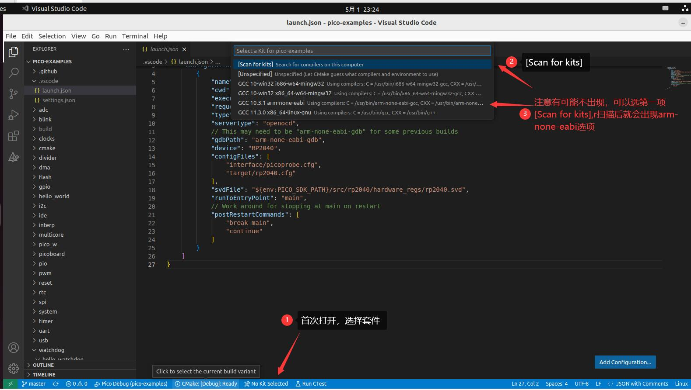
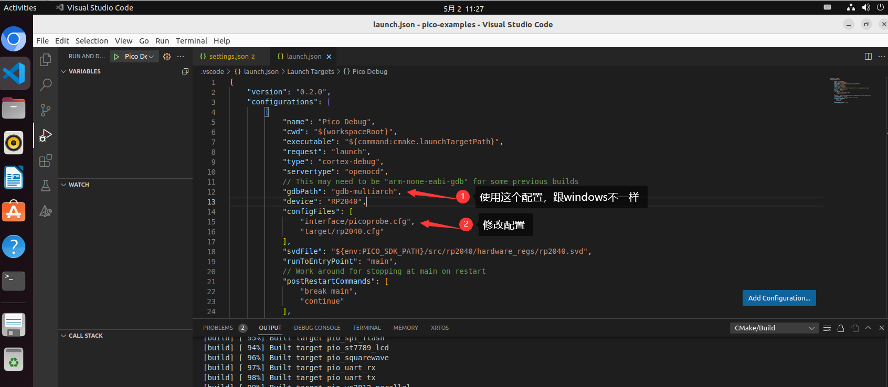

# Linux环境搭建 

\## 下载 pico-sdk 和 pico-examples

cd ~
mkdir pico
cd pico
git clone -b master https://github.com/raspberrypi/pico-sdk.git
cd pico-sdk
git submodule update --init
cd ~/pico
git clone -b master https://github.com/raspberrypi/pico-examples.git

\## 下载 pico-project-generator

cd ~/pico
git clone https://github.com/raspberrypi/pico-project-generator.git

\## 添加环境变量

echo "export PICO_SDK_PATH=/home/$USER/pico/pico-sdk" >> .bashrc

\## 安装 VSCode 插件

code --install-extension marus25.cortex-debug
code --install-extension ms-vscode.cmake-tools
code --install-extension ms-vscode.cpptools

\## 参考资料

https://datasheets.raspberrypi.com/pico/getting-started-with-pico.pdf
https://datasheets.raspberrypi.com/pico/raspberry-pi-pico-c-sdk.pdf

Ubuntu操作系统下官方手册在安装openocd时失败，参考**《(91条消息) 轻松玩转树莓派Pico之四、Ubuntu下在线debug环境搭建_._configure --enable-picoprobe_杭州_燕十三的博客-CSDN博客》**安装成功后，后来删掉成功的安装，重新按官方git下载按官方手册成功安：(，未找到具体原因

构建debug项目，参考手册22页：

You can build a debug version of the "Hello World"" with CMAKE_BUILD_TYPE=Debug as shown below

```shell
$ cd ~/pico/pico-examples 

$ rm -rf build 

$ mkdir build 

$ cd build 

$ export PICO_SDK_PATH=../../pico-sdk 

$ cmake -DCMAKE_BUILD_TYPE=Debug .. 

$ cd hello_world/serial 

$ make -j4
```

后续的调试参考上面提到的博客文章，有些细节官网未写清楚，使用openocd命令行操作跟windows有点区别

注意授权usb（*每次picoprobe连接usb后，都需要执行*）：

opencd termial

```shell
$ sudo chmod -R 777 /dev/bus/usb/
$ openocd -f interface/picoprobe.cfg -f target/rp2040.cfg
```

gdb-multiarch termial

```shell
$ cd ~/pico/pico-examples/build/hello_world/serial
$ gdb-multiarch hello_serial.elf 
Connect GDB to OpenOCD, (gdb) target remote localhost:3333
(gdb) load
Loading section .boot2, size 0x100 lma 0x10000000
Loading section .text, size 0x22d0 lma 0x10000100
Loading section .rodata, size 0x4a0 lma 0x100023d0
Loading section .ARM.exidx, size 0x8 lma 0x10002870
Loading section .data, size 0xb94 lma 0x10002878
Start address 0x10000104, load size 13324
Transfer rate: 31 KB/sec, 2664 bytes/write.
and then start it running.
(gdb) monitor reset init
(gdb) continue
(gdb) b main
(gdb) continue
(gdb) quit
```

b main 相当于在main处打断点

另外，arm-none-eabi套件首次打开不显示，查看如下操作步骤



编写自己的个人项目myblink，参考：Chapter 8. Creating your own Project，第31页。当然你也可以使用pico-project-generator来生成，但为了更好了解构建过程，建议查看第31页一步步教程


# Windows 环境

- 搭建环境

https://www.bilibili.com/video/BV1Y3411Y7Zh/?vd_source=2fb67f6a093969074e9d8af4dea29e4f

https://blog.csdn.net/tianizimark/article/details/123060724

- 安装工具链接 Arm Embedded Toolchain


https://developer.arm.com/downloads/-/gnu-rm

安装到D:\Program Files (x86)\GNU Arm Embedded Toolchain，定位到bin执行命令查看安装情况

> arm-none-eabi-gcc -v

*添加环境变量PICO_TOOLCHAIN_PATH=D:\Program Files (x86)\GNU Arm Embedded Toolchain\10 2021.10\bin*

*添加到Path*


- 安装CMake


https://cmake.org/download/

安装到D:\Program Files\CMake\，安装时勾选添加到环境变量

- 安装Python（略）


- 安装Visual Studio


https://visualstudio.microsoft.com/zh-hans/downloads/

社区版，使用C++桌面开发


- vs命令行下编译

cd 到pico-examples目录，然后mk dir build，再cd build，执行

cmake -G "NMake Makefiles" ..


- vs命令行下编译闪灯uf2

  在上面的build目录下

  cd blink

  nmake
  
  此时，在blink的目录下会有blink.uf2文件，按住pico bootset，然后把uf2拖进去重启就能看到闪灯效果
  
  

- 使用VS Code

  需安装CMakeTools插件、C++ 插件、Cortex-Debug插件

  打开配置Setting，定位到Extendsions，选中CMakeTools插件

  CMakeTools配置：

  <u>Cmake: Configure Environment</u>

  AddItem添加PICO_SDK_PATH    D:\pico\pico-sdk

  <u>Cmake: Generator</u>

  输入NMake Makefiles

然后使用**VS2017开发人员命令**（一定要使用这个打开，不然会编译错误）打开vscode，配置kit 选安装的gcc套件，build all将进行类似上面的编译


# 官方手册pico调试

材料准备：

```
win下需要安装mingw64

libusb-1.0.26-binaries.7z

libusb-1.0.26-binaries.7z\libusb-1.0.26-binaries\VS2015-x64\dll\libusb-1.0.dll，放到C:\Windows\System

zadig-2.8 清除重装使用interface2安装libusb-win32

参考：Raspberry-Pi-PICO系列--第四篇 开发环境搭建-Windows系统 + Visual Studio Code开发.mhtml
	 getting-started-with-pico.pdf（Chapter 7. Using Visual Studio Code）
```

注意配置完后，pico-examples目录建一个bat双击启动vscode，这样不用手工敲命令进入pico-examples目录

```bash
call "D:\Program Files (x86)\Microsoft Visual Studio\2017\Community\VC\Auxiliary\Build\vcvarsamd64_x86.bat"
code
```

使用openocd命令行操作，开2个cmd，一个是openocd服务，另一个cmd进行调试

```
openocd.exe -s ../tcl -f interface/picoprobe.cfg -f target/rp2040.cfg

arm-none-eabi-gdb blink.elf

target remote localhost:3333

load
monitor reset init
continue
```


# 第一个项目

demo使用的是windows环境下

查看官方手册35页，使用官方生成工具，pico-project-generator，命令行

```
cd pico-project-generator
Linux
./pico_project.py --gui
Windows
python ./pico_project.py --gui
```

钩上vscode，使用vscode开发

- 生成骨架后，把.vscode下的c_cpp_properties.json、extensions.json删掉，复制上面配好的lanch.json、setting.json配置到项目中，同时清空build目录，重新用交叉编译工具打开vscode，这里我写了个命令行**vscode.bat**，双击打开即可，打开后会提示选择arm-none-eabi-gdb，选中状态栏Build后会自动构建项目到build
- 点击debug，进入main断点开始调试，有时openocd会出现超时错误无法进行调试，你可以插拔下pico，重新debug试试
